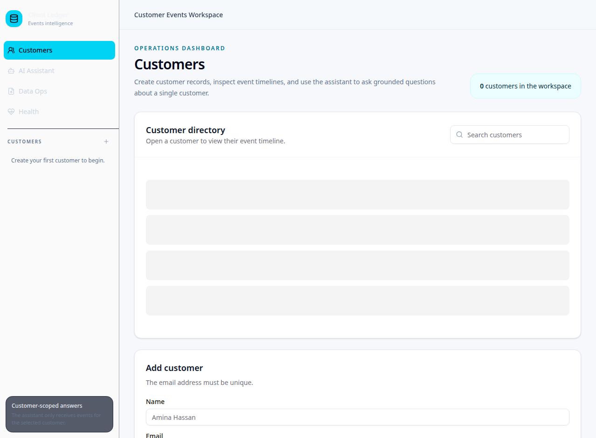

# Customer Events Workspace

> A full-stack, customer-scoped AI operations demo built to show practical AI integration, typed backend design, and auditable customer-event workflows.



## What it demonstrates

Customer Events Workspace lets an operator create customers, manage a newest-first event timeline, and ask grounded questions about a single customer. The AI context is built only from the selected customer’s events, and each answer exposes source event IDs for review.

| Capability | Implementation |
|---|---|
| Customer operations | Create, search, inspect, and delete customers; add, edit, and delete events |
| AI assistant | Server-side LLM integration with transparent Mock fallback and customer-scoped evidence |
| Typed API | tRPC contracts with Zod input validation |
| Data layer | MySQL/TiDB and Drizzle ORM; indexed newest-first customer event retrieval |
| Operations | CSV preview/import, conversation history, audit activity, Health checks, webhook contract |
| Quality | TypeScript checking, Vitest coverage, responsive Dashboard UI |

## Architecture

The frontend is a React and TypeScript Dashboard. It calls server tRPC procedures for customer, event, assistant, import, audit, and health operations. The server uses Drizzle to access a relational `customers` and `events` data model. The assistant builds context from one `customerId`, invokes the server-side LLM when configured, and otherwise returns a clearly marked Mock response. Conversation records and audit activity support reviewability.

## Run locally

```bash
pnpm install
pnpm dev
pnpm test
pnpm check
```

The app expects database configuration from the hosting environment. The LLM integration automatically falls back to Mock mode when no built-in API configuration is available.

## Key design decisions

- **Scope before generation:** only selected customer events are passed to the assistant.
- **Evidence with answers:** the API returns source event IDs for operator review.
- **Honest degradation:** Mock mode is visible instead of pretending the LLM responded.
- **Validate before writing:** event metadata must be valid JSON; CSV rows are previewed before commit.
- **Operations visibility:** the app includes Health, audit activity, conversation history, and a documented webhook contract.

## Documentation

- [Portfolio overview](./PORTFOLIO_OVERVIEW.md)
- [Demo and application package](./FOCUSKPI_APPLICATION_PACKAGE.md)
- [Webhook contract](./WEBHOOK_CONTRACT.md)

## Deliberate boundaries

This repository is a portfolio demo, not a complete enterprise CRM. Production hardening would add full multi-tenant filtering to every list query, rate limiting, a dedicated signed HTTP webhook route, background processing, retention policies, and broader integration testing. These boundaries are documented explicitly rather than represented as completed production guarantees.
